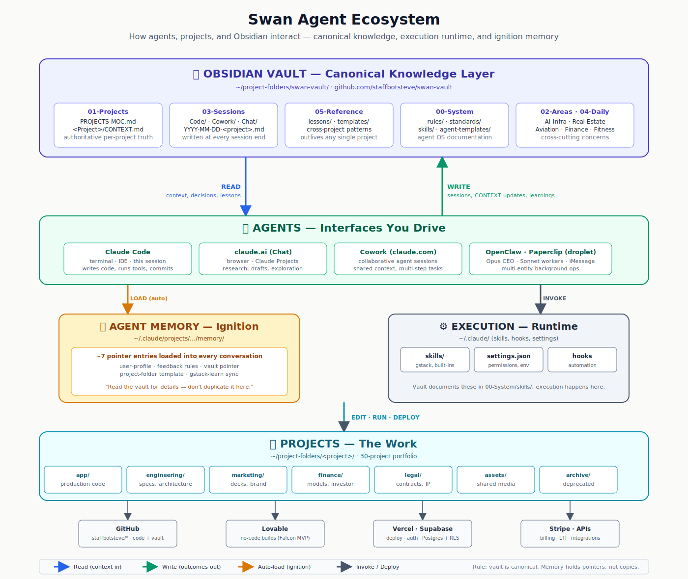
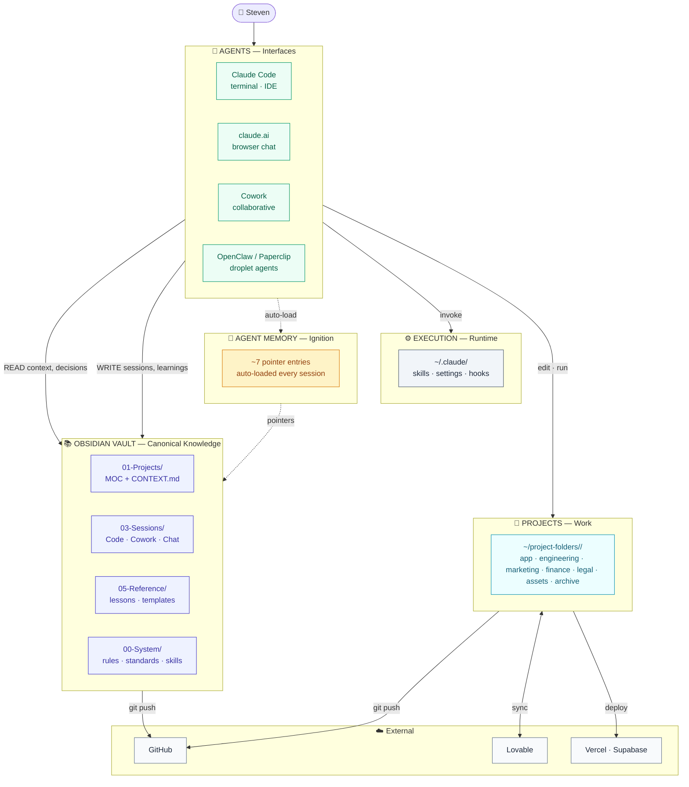

# Swan Agent Ecosystem

How the moving pieces of the portfolio work together — and when each one talks to Obsidian.

## The three-layer model

| Layer | Location | Role | Write cadence |
|---|---|---|---|
| **Vault (Canonical)** | `~/project-folders/swan-vault/` | Source of truth — projects, decisions, lessons, patterns, agent OS docs | Continuous |
| **Execution (Runtime)** | `~/.claude/` | Skills, settings, hooks. Vault *documents* them; execution happens here. | Rarely — via `/update-config` or skill install |
| **Memory (Ignition)** | `~/.claude/projects/.../memory/` | ~7 tiny pointer files loaded automatically every conversation — "read the vault for X" | Only when something changes about how to collaborate |

**Rule:** vault is canonical. Memory holds pointers, not copies. Duplicating vault content into memory creates two sources of truth that drift.

## Flow

## When each interaction fires

| Interaction | When | What moves |
|---|---|---|
| **Agent → Memory (load)** | Every session start | MEMORY.md + entry files auto-loaded into context |
| **Agent → Vault CONTEXT.md (read)** | Start of project work, before proposing changes | Project truth: status, stakeholders, decisions, folder layout |
| **Agent → Vault sessions (write)** | End of every session | Session summary at `03-Sessions/Code/YYYY-MM-DD-<project>.md` |
| **Agent → Vault lessons (write)** | When a cross-project insight crystallizes | Lesson file at `05-Reference/lessons/<domain>-<slug>.md` |
| **gstack `/learn` → local WAL** | Automatic during skill runs | JSONL append at `~/.gstack/projects/<slug>/learnings.jsonl` |
| **gstack `/learn export` → vault** | Manual (weekly or before handoffs) | WAL markdown → `05-Reference/lessons/` |
| **Agent → ~/.claude/skills** | User invokes `/skill-name` | Skill content loaded and followed |
| **Agent → Project folder** | During active code work | Edit, run, commit |
| **Project → GitHub** | On commit/push | Code repo updated; Lovable syncs if wired |
| **Vault → GitHub** | On `git push` (or Contents API) | `staffbotsteve/swan-vault` gets the update |

## Why this shape

- **Vendor independence.** Obsidian is markdown + git. If Claude Code or claude.ai goes away, the vault is still the company's brain.
- **Cross-project knowledge.** A lesson written for Project Falcon about Lovable's ceiling benefits SOSFiler and PermitVantage the moment it lands in `05-Reference/lessons/`. Memory-scoped knowledge is invisible to other tools.
- **Memory is thin.** Ignition only — 7 pointer files. No CONTEXT.md duplication. No drift.
- **Execution is separate from documentation.** Skills in `~/.claude/` execute. The vault's `00-System/skills/` tells the story.

## Related

- [[00-System/rules/core-rules]]
- [[00-System/vault-write-system]]
- [[00-System/skills/README]]
- [[05-Reference/lessons/README]]
- [[01-Projects/PROJECTS-MOC]]
